<div align="center">

<!-- HOLOGRAPHIC HEADER -->


<!-- QUANTUM TYPING EFFECT -->


</div>

<!-- MATRIX STYLE INTRO -->
```ascii
╔══════════════════════════════════════════════════════════════════════╗
║  ██╗      ██████╗  █████╗ ██████╗ ██╗███╗   ██╗ ██████╗             ║
║  ██║     ██╔═══██╗██╔══██╗██╔══██╗██║████╗  ██║██╔════╝             ║
║  ██║     ██║   ██║███████║██║  ██║██║██╔██╗ ██║██║  ███╗            ║
║  ██║     ██║   ██║██╔══██║██║  ██║██║██║╚██╗██║██║   ██║   ██╗██╗██╗ ║
║  ███████╗╚██████╔╝██║  ██║██████╔╝██║██║ ╚████║╚██████╔╝   ╚═╝╚═╝╚═╝ ║
║  ╚══════╝ ╚═════╝ ╚═╝  ╚═╝╚═════╝ ╚═╝╚═╝  ╚═══╝ ╚═════╝             ║
╚══════════════════════════════════════════════════════════════════════╝
```

<div align="center">

<!-- FLOATING STATS CUBE -->


### 🌌 INICIANDO PROTOCOLO DE CONEXIÓN...
[](https://git.io/typing-svg)

</div>

---

## 🧬 **PERFIL GENÉTICO DEL DESARROLLADOR**

<table align="center">
<tr>
<td width="50%">

```python
class QuantumDeveloper:
    def __init__(self):
        self.name = "Jorge Chavez H."
        self.reality_level = "Fullstack Architect"
        self.dimensional_experience = "4+ years"
        self.quantum_location = "Lima, Perú 🇵🇪"
        self.neural_networks = [
            "PHP", "Laravel", "JavaScript", 
            "React", "Vue.js", "Python", "Django"
        ]
        self.consciousness_state = "Always Learning"
        
    def get_superpower(self):
        return "Converting caffeine into clean code ⚡"
        
    def current_mission(self):
        return "Building the future, one commit at a time 🚀"
```

</td>
<td width="50%">

<!-- HOLOGRAPHIC SKILLS MATRIX -->


**⚡ QUANTUM ABILITIES UNLOCKED:**
- 🎯 **Frontend Mastery**: React | Vue.js | TailwindCSS
- 🔥 **Backend Wizardry**: Laravel | Django | APIs
- 🗄️ **Data Manipulation**: MySQL | PostgreSQL
- 🛠️ **DevOps Sorcery**: Docker | Linux | Git
- 🔮 **Future Tech**: AI Integration | Microservices

</td>
</tr>
</table>

---

## 💫 **DIMENSIONAL STATISTICS**

<div align="center">

<!-- GLOWING STATS GRID -->


<!-- NEURAL NETWORK ACTIVITY -->


<!-- QUANTUM COMMIT GRAPH -->


</div>

---

## 🌐 **REALIDAD AUMENTADA: PROYECTOS**

<div align="center">

<!-- PROJECT HOLOGRAM -->
<table>
<tr>
<td align="center" width="25%">

<br><b>🛒 E-COMMERCE NEXUS</b>
<br><sub>Sistema cuántico de ventas</sub>
<br><code>Laravel • MySQL • API SUNAT</code>
</td>
<td align="center" width="25%">

<br><b>🦷 DENTAL MATRIX</b>
<br><sub>Panel multidimensional</sub>
<br><code>Laravel • Vue.js • Bootstrap</code>
</td>
<td align="center" width="25%">

<br><b>🏗️ CONSTRUCTION AI</b>
<br><sub>Calculadora inteligente</sub>
<br><code>Django • Python • ML</code>
</td>
<td align="center" width="25%">

<br><b>🔐 API FORTRESS</b>
<br><sub>Gateway de seguridad</sub>
<br><code>Laravel • JWT • Redis</code>
</td>
</tr>
</table>

</div>

---

## 🔮 **ROADMAP CUÁNTICO 2024-2025**

```mermaid
mindmap
  root((JORGE 2025))
    🐳 DevOps Master
      Docker Swarm
      Kubernetes
      CI/CD Pipelines
    ☁️ Cloud Architect
      AWS Certification
      Serverless
      Microservices
    🔐 Security Expert
      Ethical Hacking
      Penetration Testing
      Cybersecurity
    🤖 AI Integration
      Machine Learning
      Neural Networks
      AI-Powered Apps
    📱 Mobile Universe
      React Native
      Flutter
      Cross-Platform
```



---

## ⚡ **TECH STACK CONSTELLATION**

<div align="center">

### 🌟 **FRONTEND GALAXY**


### 🔥 **BACKEND DIMENSION**


### 🗄️ **DATA UNIVERSE**


### 🛠️ **QUANTUM TOOLS**


</div>

---

## 🎯 **ACHIEVEMENT UNLOCKED**

<div align="center">

| 🏆 **MILESTONE** | 📊 **PROGRESS** | 🎖️ **STATUS** |
|:---:|:---:|:---:|
| **Code Commits** |  | `2,847+ commits` |
| **Projects Deployed** |  | `15+ live projects` |
| **Technologies Mastered** |  | `12+ tech stacks` |
| **Coffee Consumed** |  | `∠cups ☕` |

</div>

---

## 🌌 **PORTAL DE COMUNICACIÓN**

<div align="center">

<!-- GLOWING CONTACT BADGES -->
[](mailto:jorgedeveloper09@gmail.com)
[](https://wa.me/51978437753)
[](#)
[](#)

</div>

---

<div align="center">

### 💭 *"El futuro pertenece a quienes creen en la belleza de sus sueños digitales"*

<!-- QUANTUM VISITOR COUNTER -->


<!-- HOLOGRAPHIC FOOTER -->


<!-- MATRIX RAIN EFFECT -->
```
    ╔══════════════════════════════════════════════════╗
    ║              END OF TRANSMISSION                 ║
    ║         >>> DISCONNECTING FROM MATRIX <<<        ║
    ╚══════════════════════════════════════════════════╝
```

</div>
